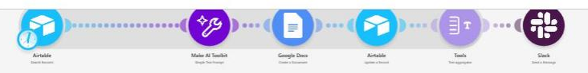
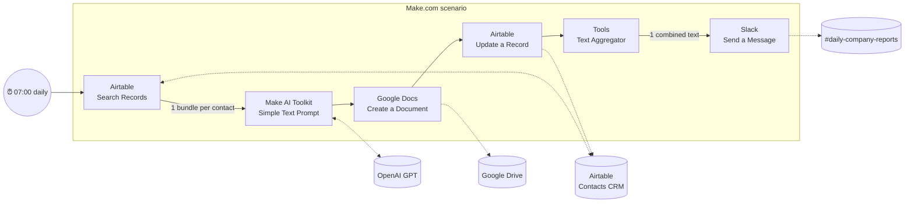
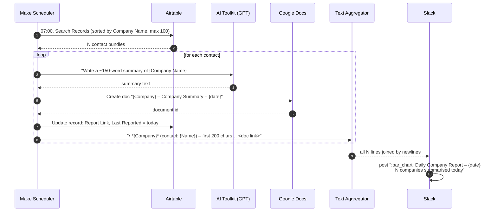
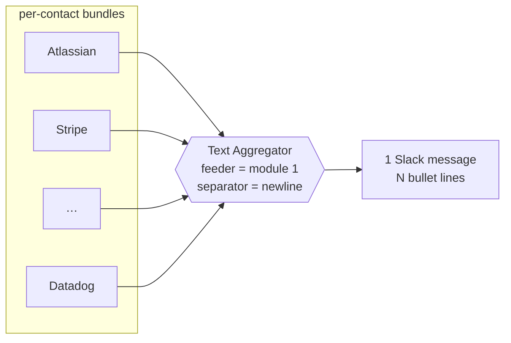
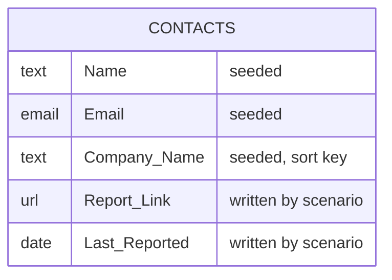
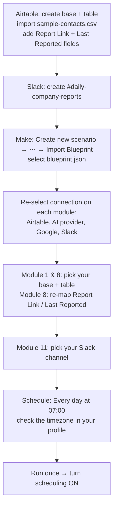
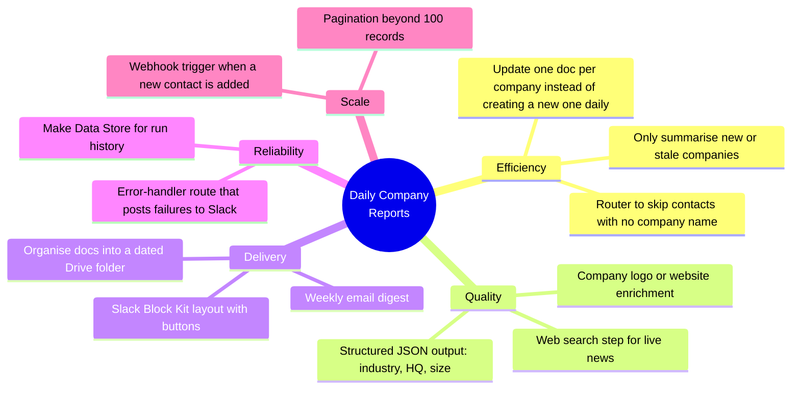

# Daily Company Reports: Make.com Automation

A no-code [Make.com](https://www.make.com) scenario that runs **every day at 7:00 AM**. It reads a contact list from **Airtable**, uses AI to write a short summary of each contact's **company**, saves each summary as a **Google Doc**, writes the doc link back to Airtable, and posts one digest message to a **Slack** channel.



**Live shared scenario:** https://eu1.make.com/public/shared-scenario/IrF9DXhL5yV/daily-company-reports
**Importable blueprint:** [`blueprint.json`](blueprint.json)

## What it does

| Requirement | How it's met |
|---|---|
| A list of random contacts in Airtable (Name, Email, Company Name) | Airtable base **Contacts CRM** → table **Contacts**, seeded from [`sample-contacts.csv`](sample-contacts.csv) |
| A summary report of each company written by ChatGPT | **Make AI Toolkit** module (OpenAI GPT model) with a factual, ~150-word analyst prompt |
| The report saved as a Google Doc containing the company name and the summary | **Google Docs → Create a Document**: company name as the H1 title, then the summary and the contact line |
| Sent to a Slack channel every day at 7:00 AM | Scenario schedule at 07:00 daily → one aggregated message in `#daily-company-reports` |

## Architecture



## Daily run, step by step



## Modules

| # | Module | Key configuration |
|---|---|---|
| 1 | **Airtable – Search Records** | Base `Contacts CRM`, table `Contacts`, sort `Company Name` ascending, limit 100 |
| 12 | **Make AI Toolkit – Simple Text Prompt** | Model `gpt-5-nano` (small, minimal reasoning). Prompt below |
| 7 | **Google Docs – Create a Document** | Name `{{Company Name}} – Company Summary – {{formatDate(now; DD MMM YYYY)}}`, saved in My Drive root. HTML body: `<h1>` company, summary paragraphs, contact line |
| 8 | **Airtable – Update a Record** | Sets `Report Link` (doc URL) and `Last Reported` (today) on the same contact |
| 9 | **Tools – Text Aggregator** | Fed by module 1, so all contacts collapse into **one** bundle, one line per company |
| 11 | **Slack – Send a Message** | Public channel `#daily-company-reports`, markdown on, header line + count + aggregated lines |

**AI prompt** (module 12):

> You are a business analyst. Write concise, factual company summaries. If you are unsure about a fact, leave it out rather than guess. Write a summary report of the company "{{Company Name}}" in about 150 words. Cover: what the company does, its main products or services, industry, headquarters, and one notable recent focus. Use plain text with short paragraphs, no markdown.

The aggregator is why Slack gets one digest message instead of N separate pings:



## Data model (Airtable `Contacts` table)



## Sample output

**Google Doc**: `Atlassian – Company Summary – 05 Oct 2026`
> # Atlassian
> Atlassian is a software company that develops collaboration and productivity tools for teams…
> *Contact: Meera Joshi (meera.joshi@example.com)*

**Slack message**:
```
📊 Daily Company Report – 05 Oct 2026
10 companies summarised today.

• Atlassian (contact: Meera Joshi) – Atlassian is a software company that develops collaboration a… Open full report
• Canva (contact: Ananya Rao) – …
```

## Set it up in your own Make account



1. **Airtable**: create a base with a `Contacts` table that has the fields `Name`, `Email`, `Company Name` (all text), `Report Link` (URL or text) and `Last Reported` (date). Import [`sample-contacts.csv`](sample-contacts.csv).
2. **Slack**: create a channel, for example `#daily-company-reports`.
3. **Make**: go to **Scenarios → Create a new scenario → ⋯ (bottom toolbar) → Import Blueprint** and choose `blueprint.json`.
4. **Connections**: the blueprint ships with no connections. Open each module and add your own Airtable, Google, Slack and AI-provider connections. Make's built-in AI provider works, or you can use your own OpenAI key.
5. **IDs**: the placeholders `appYOUR_BASE_ID`, `tblYOUR_TABLE_ID` and `YOUR_SLACK_CHANNEL_ID` are replaced as soon as you pick the base, table and channel from the dropdowns. In module 8, map `Report Link` and `Last Reported` again, because Airtable field IDs are different in every base.
6. **Schedule**: Make doesn't import the schedule with the blueprint. Set it to *Every day at 07:00* (see [`schedule.json`](schedule.json)). The time follows the timezone set in your Make profile.

## Repo contents

```
├── blueprint.json        # sanitized Make scenario, ready to import
├── schedule.json         # schedule the live scenario uses (daily 07:00)
├── sample-contacts.csv   # 10 fake contacts to seed Airtable
├── sanitize.py           # strips connections/IDs/run data from a blueprint before publishing
└── docs/scenario.png     # canvas screenshot
```

### Re-exporting after changes

When the scenario changes, run the sanitizer again before committing, so connection IDs, account labels, run samples, and Airtable or Slack IDs never reach git:

```bash
python sanitize.py --shared IrF9DXhL5yV          # from the public share link
python sanitize.py exported-blueprint.json       # or from Make's "Export Blueprint" file
```

## Design decisions

- **One Slack digest instead of N messages**: the Text Aggregator keeps the channel readable.
- **The doc link is written back to Airtable**: the CRM becomes the record of when each company was last reported and where the report is.
- **Low-hallucination prompt**: the model is told to leave out facts it isn't sure of rather than guess.
- **Cheap model**: `gpt-5-nano` with minimal reasoning costs about 300 tokens per company, which is enough for a 150-word summary.

## Limitations

- A fresh doc is created for **every contact every day**, so Drive fills up and the same company is summarised again each day.
- Summaries come from the model's training data, not live web data, so recent news may be missing or out of date.
- Search Records is capped at 100 contacts per run.
- If one module fails, Make retries and stops after 3 consecutive errors (`maxErrors: 3`). There's no Slack alert when that happens.

## Future scope



| Idea | Value | How in Make |
|---|---|---|
| **Only summarise new or stale companies** | far fewer AI calls and docs | Airtable formula `OR({Last Reported}=BLANK(), DATETIME_DIFF(TODAY(),{Last Reported},'days')>7)` |
| **Error alerts** | failures stop being silent | add an error-handler route on the AI and Docs modules that sends a Slack message |
| **Live news** | up-to-date summaries | add an HTTP or search module before the AI step and pass its results into the prompt |
| **Structured output** | sortable industry and HQ columns in Airtable | have the AI return JSON, then use **Parse JSON** and map the fields into Airtable |
| **Block Kit Slack message** | richer layout with buttons | set the `blocks` field on the Slack module |
| **Instant trigger** | a report as soon as a contact is added | Airtable **Watch Records** as a second scenario |

## License

MIT
